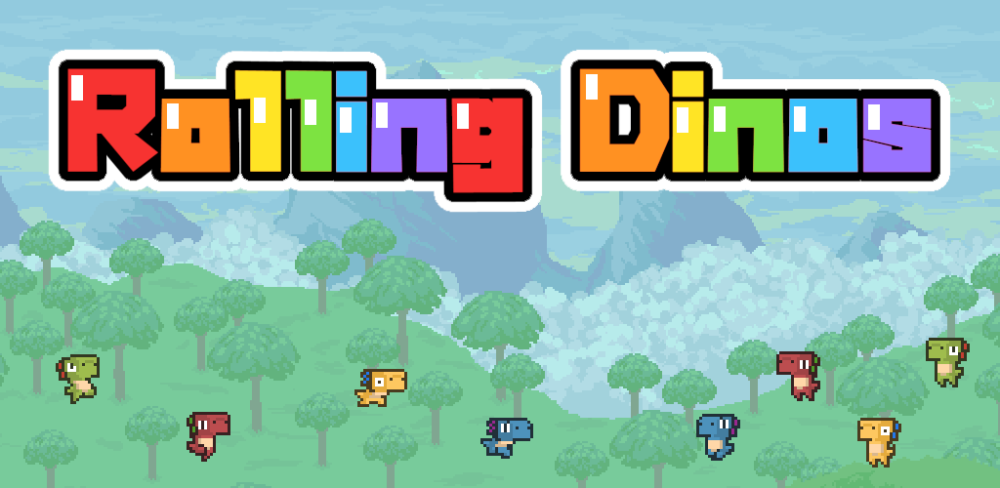
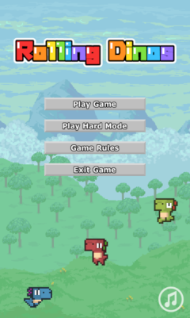
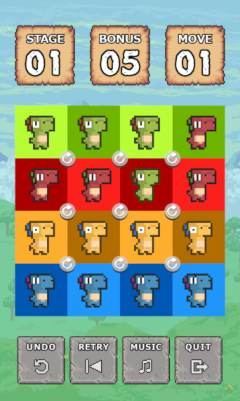
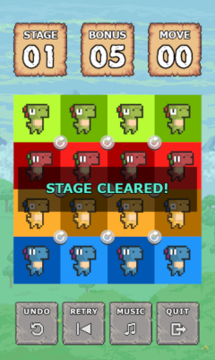
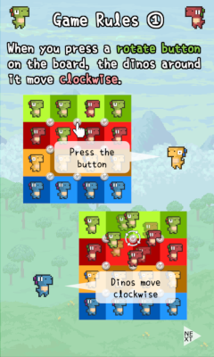
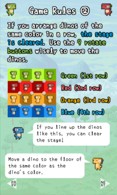
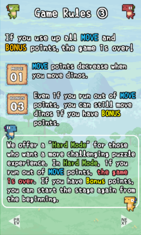
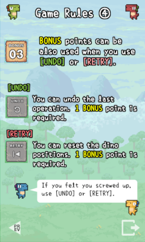

[日本語](rollingdinosjp.md)

# Rolling Dinos

This app is a puzzle game where you control 16 dinosaurs on the game board. 
If you can align dinosaurs of the same color in a row, the stage is cleared.

The only way to move the dinosaurs is to press the 9 spin buttons embedded on the game board. 
The number of times you can press the button is limited. 

Think carefully and guide the dinosaurs to the desired location in a limited number of times!

The average playing time is about 5 to 30 minutes. 
The rules are simple, but it's a challenging puzzle game. 

From children to the elderly, please try playing.

# Rules

