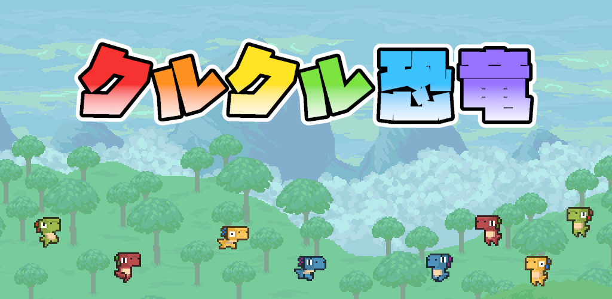
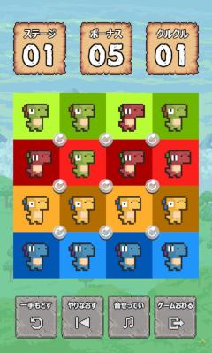
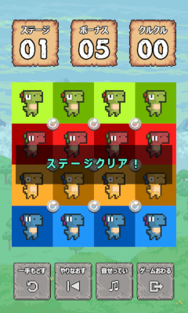
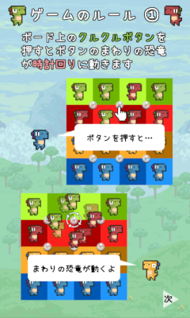
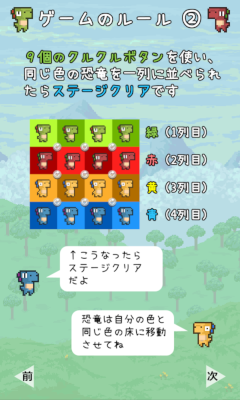

[English Page](rollingdinos.md)

# クルクル恐竜

クルクル恐竜は、パズルゲームです。

プレイヤーは、ゲームボード上の16匹の恐竜を操作します。

同じ色の恐竜同士を一列に揃えることができれば、ステージクリアです。

恐竜たちを動かすただ一つの方法は、ゲームボード上に埋め込まれた9個の回転ボタンを押すこと。
よく考えて、恐竜たちを目的の場所に誘導してください。

ルールはシンプルですが、やりがいのあるパズルゲームです。

子供からご年配の方まで、ぜひプレイしてみてください。

## Download

